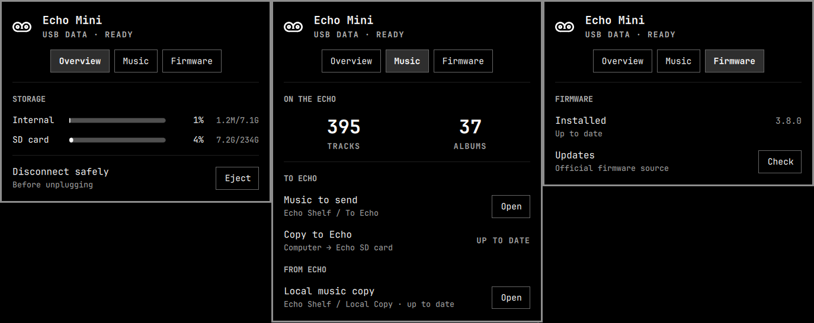

# Echo Shelf for Omarchy

A small Omarchy Quattro bar widget for the Snowsky Echo Mini: connection and storage at a glance, non-destructive music transfer, safe eject, and a guided firmware flow.



## What it shows

- `Overview` — USB Data or DAC state, occupied/total storage, usage percentage, and safe eject.
- `Library` — track and album counts, a one-click Inbox, send-to-Echo status, and import status.
- `Firmware` — the installed version. Update controls appear only when action is required.
- The bar icon disappears when the player is disconnected.

## Deliberately absent

- Raw USB, mount, manifest, checksum, and helper output. The panel shows the task, not the implementation.
- Audio output controls. Omarchy's stock Audio panel already owns those.
- Automatic deletion or mirroring. Music transfer only adds or updates safe targets.
- Automatic firmware-version guessing. The installed version is confirmed from the Echo's own screen.

## Requirements

- Omarchy Quattro.
- A Snowsky Echo Mini connected in USB Data or USB DAC mode.
- Standard Omarchy tools used by the helper: `curl`, `rsync`, `unzip`, `zip`, `udisksctl`, `udevadm`, and `xdg-open`.

No install hook, package installation, background service, or elevated access is used. The library features work with supported Echo Mini storage; the firmware flow is tested and restricted to the 8 GB model/package.

## Install

```bash
omarchy plugin add https://github.com/subirats345/echo-shelf --enable
omarchy bar move io.github.subirats345.echo-shelf
```

The [Omarchy Plugins listing](https://omarchyplugins.com/) installs the same public repository.

Update later with:

```bash
omarchy plugin update io.github.subirats345.echo-shelf
```

## Music transfer

Echo Shelf creates these folders when needed:

- `~/Music/Echo Shelf Inbox` — add music here, then use **Send to Echo**.
- `~/Music/Echo Shelf Library` — receives missing music from **Import from Echo**.

The expected player layout is:

```text
01_Category/Album/track.flac
```

Supported audio and album covers are copied. WavPack is reported as unsupported, files outside the numbered category layout are skipped, local import conflicts are preserved, and neither direction deletes music.

## Firmware

Echo Shelf checks FiiO's official Echo Mini firmware page every six hours and caches the result. Preparing an update requires a clean Library import, validates the official 8 GB archive and image, records SHA-256 hashes, and backs up internal storage before any firmware copy.

Install remains a deliberate physical flow: safely eject, disconnect, remove the SD card, reconnect in USB Data, install, restart the Echo, then confirm the version shown on the player. Every write step requires explicit confirmation.

## Keyboard

| Key | Action |
| --- | --- |
| `o` / `1` | Overview |
| `l` / `2` | Library |
| `f` / `3` | Firmware |
| `←` / `→` | Previous or next tab |
| `Esc` | Close panel |

## Test

```bash
./echo-mini-status --self-test
omarchy plugin validate .
qmllint -I /usr/share/omarchy/shell -I /usr/lib/qt6/qml BarWidget.qml
```

## Remove

```bash
omarchy plugin remove io.github.subirats345.echo-shelf
```

Removal leaves your Inbox, imported Library, firmware backups, and cached/configured state untouched.

## License

The plugin code is available under the [MIT License](LICENSE). `media-tape.svg` comes from the GNOME HighContrast icon theme and remains under LGPL-2.1-only; see [THIRD_PARTY_NOTICES.md](THIRD_PARTY_NOTICES.md).

Snowsky, Echo Mini, FiiO, Omarchy, and GNOME are trademarks or projects of their respective owners. This community plugin is not affiliated with or endorsed by them.
